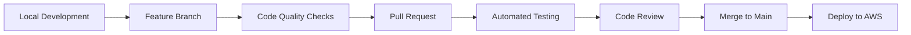

# 🌟 Aura - AI-Powered IT Management Suite

A comprehensive IT service management platform built with **Python FastAPI microservices** backend and **React.js** frontend, featuring AI-powered ticket routing, knowledge base optimization, and intelligent chatbot assistance.

## 📋 Table of Contents

- [🚀 Quick Start](#-quick-start)
- [🏗️ Project Structure](#️-project-structure)
- [🔧 Prerequisites](#-prerequisites)
- [⚙️ Installation & Setup](#️-installation--setup)
- [🏃‍♂️ Running the Application](#️-running-the-application)
- [🧪 Testing](#-testing)
- [🔍 Troubleshooting](#-troubleshooting)
- [📚 API Documentation](#-api-documentation)
- [🎨 UI/UX Features](#-uiux-features)
- [🤝 Contributing](#-contributing)

## 🚀 Quick Start

**Get running in 3 minutes with our cross-platform startup scripts:**

### Option 1: Universal Python Scripts (Recommended)
Works on **Windows, macOS, and Linux** with automatic dependency management:

```bash
# 1. Clone the repository
git clone https://github.com/bijjula/superOps_vibecoding.git
cd superOps_vibecoding

# 2. Start API Gateway (Terminal 1)
cd aura-backend
python start_api_gateway.py

# 3. Start Service Desk Host (Terminal 2) 
cd aura-backend
python start_service_desk.py

# 4. Start Frontend (Terminal 3)
cd aura-frontend
npm install && npm start

# 5. Open http://localhost:3000 in your browser
```

### Option 2: Platform-Specific Scripts

#### Windows:
```cmd
cd aura-backend
start_api_gateway.bat          # Terminal 1
start_service_desk.bat         # Terminal 2
cd ..\aura-frontend && npm start # Terminal 3
```

#### Mac/Linux:
```bash
cd aura-backend
./start_api_gateway.sh         # Terminal 1
./start_service_desk.sh        # Terminal 2
cd ../aura-frontend && npm start # Terminal 3
```

### What These Scripts Do Automatically:
- ✅ **Create virtual environments** (if missing)
- ✅ **Install Python dependencies** 
- ✅ **Check database services** (PostgreSQL, MongoDB, Redis)
- ✅ **Set up environment variables** (creates .env from .env.example)
- ✅ **Fix import path issues** (PYTHONPATH configuration)
- ✅ **Provide detailed setup instructions** when services are missing

📖 **Detailed Guides:**
- **API Gateway**: See [aura-backend/README_STARTUP.md](aura-backend/README_STARTUP.md)
- **Service Desk Host**: See [aura-backend/README_SERVICE_DESK.md](aura-backend/README_SERVICE_DESK.md)

## 🏗️ Project Structure

```
superOps_vibecoding/
├── 📂 aura-backend/              # Python FastAPI Microservices
│   ├── 📂 api-gateway/           # Main API Gateway
│   │   ├── main.py               # Gateway entry point
│   │   ├── requirements.txt      # Python dependencies
│   │   └── Dockerfile           # Container config
│   ├── 📂 service-desk-host/     # Service Desk Microservice
│   │   ├── main.py               # Service entry point
│   │   ├── requirements.txt      # Service dependencies
│   │   └── Dockerfile           # Container config
│   ├── 📂 shared/               # Shared utilities
│   │   ├── 📂 database/         # Database utilities
│   │   ├── 📂 middleware/       # Common middleware
│   │   ├── 📂 models/           # Shared data models
│   │   └── 📂 utils/            # AI services & utilities
│   ├── .env.example             # Environment variables template
│   └── docker-compose.yml       # Multi-service orchestration
├── 📂 aura-frontend/            # React.js Frontend Application
│   ├── 📂 public/               # Static assets
│   ├── 📂 src/                  # Source code
│   │   ├── 📂 components/       # Reusable UI components
│   │   │   └── 📂 layout/       # Layout components (Header, Sidebar)
│   │   ├── 📂 pages/            # Application pages
│   │   │   ├── 📂 Dashboard/    # Main dashboard
│   │   │   ├── 📂 ServiceDesk/  # Ticket management
│   │   │   ├── 📂 KnowledgeBase/# Knowledge base interface
│   │   │   └── 📂 Chatbot/      # AI assistant interface
│   │   ├── 📂 services/         # API service layer
│   │   ├── 📂 theme/            # SAP Fiori theme configuration
│   │   ├── App.js               # Main app component
│   │   └── index.js             # Entry point
│   ├── package.json             # Node.js dependencies
│   └── package-lock.json        # Dependency lock file
├── 📂 docs/                     # Project documentation
│   ├── Functional_Specification_Document.md
│   └── Product_Requirement_Document.md
├── 📂 prompts/                  # Development prompts & guides
└── README.md                    # This file
```

## 🔧 Prerequisites

Ensure you have the following installed on your system:

### Required Software

| Software | Version | Installation | Notes |
|----------|---------|--------------|-------|
| **Python** | 3.8+ | [Download Python](https://python.org/downloads/) | **Python 3.13 supported** with fallback options |
| **Node.js** | 16+ | [Download Node.js](https://nodejs.org/) | |
| **npm** | 8+ | Comes with Node.js | |
| **Git** | Latest | [Download Git](https://git-scm.com/) | |

### Required for AWS Deployment
- **Docker** 20.10+ - [Download Docker](https://docker.com/get-started) - **Required for AWS deployment**
- **Docker Compose** 2.0+ - Usually included with Docker Desktop
- **AWS CLI** 2.0+ - [Install AWS CLI](https://docs.aws.amazon.com/cli/latest/userguide/install-cliv2.html)
- **jq** - JSON processor - `brew install jq` (macOS) or `sudo apt-get install jq` (Ubuntu)

### Python Version Compatibility

| Python Version | Support Level | Startup Method | Notes |
|----------------|---------------|----------------|-------|
| **Python 3.11-3.12** | ✅ **Fully Supported** | Standard scripts | Recommended for development |
| **Python 3.13+** | ⚠️ **Compatible with Fallbacks** | Safe startup scripts | Some packages may require compilation |
| **Python 3.8-3.10** | ✅ **Supported** | Standard scripts | Stable but older |

### Verify Installation

```bash
# Check versions
python --version    # Should show Python 3.8+
node --version      # Should show Node v16+
npm --version       # Should show npm 8+
git --version       # Should show git version

# Check Python 3.13 compatibility (if using Python 3.13)
cd aura-backend
python check_compatibility.py
```

### 🐍 **Python 3.13 Specific Setup**

If you're using Python 3.13, some packages may require compilation. We've provided compatibility solutions:

#### **Recommended Approach for Python 3.13:**

```bash
# 1. Check compatibility first
cd aura-backend
python check_compatibility.py

# 2. Use the safe startup method
./start_service_desk_safe.sh

# 3. If compilation issues occur, use minimal requirements
pip install -r requirements_minimal.txt
```

#### **What the Safe Startup Does:**
- ✅ **Installs core dependencies** that work reliably on Python 3.13
- ⚠️ **Attempts asyncpg installation** (may fail - uses sync PostgreSQL fallback)
- ✅ **Provides clear feedback** on what's working vs. limited
- ✅ **Maintains full functionality** with performance optimizations where possible

#### **Python 3.13 Compatibility Matrix:**

| Package | Status | Fallback | Notes |
|---------|--------|----------|-------|
| **FastAPI** | ✅ Full Support | N/A | Latest version compatible |
| **Pydantic** | ✅ Full Support | N/A | v2.10.2+ has Python 3.13 wheels |
| **SQLAlchemy** | ✅ Full Support | N/A | Works with sync and async |
| **AsyncPG** | ⚠️ May Need Compilation | Sync PostgreSQL | Falls back gracefully |
| **Motor (MongoDB)** | ✅ Full Support | N/A | Async MongoDB driver works |
| **Redis** | ✅ Full Support | N/A | Full async support |
| **OpenAI SDK** | ✅ Full Support | N/A | Latest version compatible |

#### **If You Encounter Issues:**

```bash
# Option 1: Use our pre-configured safe startup
cd aura-backend
./start_service_desk_safe.sh

# Option 2: Manual minimal installation
cd aura-backend
source venv/bin/activate
pip install -r requirements_minimal.txt
python test_dependencies.py

# Option 3: Alternative Python versions
# Consider using Python 3.11 or 3.12 for development
pyenv install 3.12.0  # if using pyenv
pyenv local 3.12.0
```

**💡 Pro Tip:** For production deployments with Python 3.13, test thoroughly with our safe startup scripts to ensure all features work as expected.

## ⚙️ Installation & Setup

### 1. Clone the Repository

```bash
git clone https://github.com/bijjula/superOps_vibecoding.git
cd superOps_vibecoding
```

### 2. Backend Setup (Python FastAPI Microservices)

```bash
# Navigate to backend directory
cd aura-backend

# Create Python virtual environment
python -m venv venv

# Activate virtual environment
# On macOS/Linux:
source venv/bin/activate
# On Windows:
venv\Scripts\activate

# Install dependencies
pip install -r api-gateway/requirements.txt
pip install -r service-desk-host/requirements.txt

# Optional: Set up environment variables
cp .env.example .env
# Edit .env file with your configuration
```

### 3. Frontend Setup (React.js Application)

```bash
# Navigate to frontend directory (in a new terminal)
cd aura-frontend

# Install Node.js dependencies
npm install

# Optional: Verify installation
npm list --depth=0
```

## 🏃‍♂️ Running the Application

### 🎯 Manual Startup Guide (Production-Ready Method)

This comprehensive guide explains each step, its importance, and what happens behind the scenes to help your team understand the complete application architecture.

#### 📋 **Step-by-Step Manual Setup Process**

**Why Manual Setup?** Manual setup gives you complete control over each service, better debugging capabilities, and deep understanding of the microservices architecture. It's essential for development, troubleshooting, and production deployments.

---

### **Phase 1: Environment Preparation** 🛠️

#### **Step 1: Repository Setup**
```bash
# Clone the repository
git clone https://github.com/bijjula/superOps_vibecoding.git
cd superOps_vibecoding
```
**Why Important:** This gets the latest codebase with all microservices, shared utilities, and configuration files.

#### **Step 2: Backend Environment Setup** 
```bash
# Navigate to backend directory
cd aura-backend

# Create Python virtual environment
python -m venv venv

# Activate virtual environment
# On macOS/Linux:
source venv/bin/activate
# On Windows:
venv\Scripts\activate
```

**🔍 Why Virtual Environment is Critical:**
- **Isolation**: Prevents conflicts between project dependencies and system Python packages
- **Version Control**: Ensures consistent Python package versions across team members
- **Clean Deployment**: Makes it easier to replicate the exact environment in production
- **Dependency Management**: Allows different projects to use different versions of the same package

#### **Step 3: Install Backend Dependencies**
```bash
# Install API Gateway dependencies
pip install -r api-gateway/requirements.txt

# Install Service Desk dependencies  
pip install -r service-desk-host/requirements.txt
```

**🔍 What This Installs & Why:**
- **FastAPI**: Modern, fast web framework for building APIs with automatic documentation
- **uvicorn**: ASGI server for running FastAPI applications with high performance
- **pydantic**: Data validation using Python type annotations
- **pymongo**: MongoDB driver for Python
- **openai**: Integration with OpenAI's GPT models for AI-powered features
- **redis**: In-memory data structure store for caching and session management
- **And more...** Each dependency serves a specific architectural purpose

#### **Step 4: Environment Variables Configuration**
```bash
# Copy environment template
cp .env.example .env

# Edit .env file with your configuration
nano .env  # or your preferred editor
```

**🔍 Critical Environment Variables Explained:**
- **OPENAI_API_KEY**: Required for AI-powered ticket categorization and chatbot functionality
- **DATABASE_URL**: PostgreSQL connection for persistent data storage
- **MONGODB_URL**: MongoDB connection for document-based ticket storage
- **REDIS_URL**: Redis connection for caching and real-time features
- **Service URLs**: Inter-service communication endpoints for microservices architecture

---

### **Phase 2: Database Services Startup** 🗄️

#### **Step 5: Start Database Infrastructure**
```bash
# Start all database services using Docker
docker-compose up -d postgres mongo redis rabbitmq

# Wait for services to initialize (critical!)
sleep 30

# Verify services are running
docker-compose ps
```

**🔍 Why Each Database Service is Essential:**

**PostgreSQL (Port 5432):**
- **Purpose**: Primary relational database for structured data
- **Usage**: User accounts, configuration settings, audit logs
- **Why Important**: ACID compliance, complex queries, data integrity

**MongoDB (Port 27017):**
- **Purpose**: Document database for flexible, schema-less data
- **Usage**: Ticket storage, knowledge base articles, chat history  
- **Why Important**: Flexible schema, horizontal scaling, JSON-like documents

**Redis (Port 6379):**
- **Purpose**: In-memory data store for caching and real-time features
- **Usage**: Session management, API response caching, real-time notifications
- **Why Important**: Sub-millisecond latency, pub/sub messaging, data expiration

**RabbitMQ (Port 5672, Management: 15672):**
- **Purpose**: Message queue for asynchronous communication
- **Usage**: Inter-service communication, background task processing
- **Why Important**: Reliable message delivery, load balancing, decoupling services

#### **Step 6: Initialize Sample Data**
```bash
# Generate sample tickets for testing
python generate_simple_tickets.py

# Verify data generation
ls -la sample_tickets.json
```

**🔍 Why Sample Data Matters:**
- **Immediate Testing**: Provides realistic data to test all application features
- **Demo Preparation**: Ready-to-show functionality for stakeholders
- **Development**: Helps developers understand data structures and relationships

---

### **Phase 3: Backend Services Startup** 🚀

#### **Step 7A: Start API Gateway (Terminal 1)**
```bash
# Ensure you're in backend directory with activated venv
cd aura-backend
source venv/bin/activate  # Windows: venv\Scripts\activate

# Start the API Gateway
python api-gateway/main.py
```

**🔍 API Gateway Role & Importance:**
- **Single Entry Point**: All frontend requests go through this gateway
- **Request Routing**: Distributes requests to appropriate microservices
- **Cross-Cutting Concerns**: Handles authentication, rate limiting, CORS
- **Load Balancing**: Can distribute load across multiple service instances
- **Monitoring**: Centralized logging and metrics collection
- **Port**: 8000 - This becomes your main API endpoint

**What Happens When Started:**
- Initializes FastAPI application with all routes
- Establishes connections to all database services
- Registers middleware for CORS, authentication, and logging
- Starts health check endpoints
- Begins listening for HTTP requests on port 8000

#### **Step 7B: Start Service Desk Microservice (Terminal 2)**
```bash
# Open new terminal and navigate to backend
cd aura-backend
source venv/bin/activate  # Windows: venv\Scripts\activate

# Start Service Desk microservice
python service-desk-host/main.py
```

**🔍 Service Desk Microservice Role:**
- **Ticket Management**: Handles all ticket CRUD operations
- **AI Processing**: Integrates with OpenAI for ticket categorization
- **Business Logic**: Implements service desk specific workflows
- **Data Processing**: Handles complex ticket analytics and reporting
- **Port**: 8001 - Internal service communication

**What Happens When Started:**
- Connects to MongoDB for ticket storage
- Initializes AI service connections (OpenAI)
- Sets up background task processing
- Registers with API Gateway for service discovery
- Starts processing ticket-related requests

---

### **Phase 4: Frontend Application Startup** 🎨

#### **Step 8: Frontend Setup (Terminal 3)**
```bash
# Open new terminal and navigate to frontend
cd aura-frontend

# Install Node.js dependencies (first time only)
npm install

# Start React development server
npm start
```

**🔍 Frontend Architecture & Purpose:**
- **React.js**: Modern component-based UI framework
- **Material-UI**: SAP Fiori-themed enterprise design system
- **React Router**: Client-side navigation and routing
- **Axios**: HTTP client for API communication
- **Chart.js**: Data visualization for dashboards and analytics
- **Port**: 3000 - User-facing web application

**What Happens During npm install:**
- Downloads all JavaScript dependencies specified in package.json
- Creates node_modules directory with all packages
- Generates package-lock.json for dependency version locking
- Sets up development tools and build scripts

**What Happens During npm start:**
- Starts Webpack development server with hot reloading
- Compiles React components and JavaScript modules
- Serves static assets and handles routing
- Opens browser automatically to http://localhost:3000
- Enables real-time code updates without page refresh

---

### **Phase 5: Verification & Access** ✅

#### **Step 9: Verify All Services**

**Service Status Check:**
```bash
# Check API Gateway health
curl http://localhost:8000/health

# Check Service Desk health  
curl http://localhost:8001/health

# Verify frontend is accessible
curl http://localhost:3000
```

**Database Connectivity Check:**
```bash
# Check MongoDB connection
docker exec aura-backend-mongo-1 mongosh aura_servicedesk --eval "db.tickets.countDocuments()"

# Check PostgreSQL connection
docker exec aura-backend-postgres-1 psql -U aura_user -d aura_servicedesk -c "SELECT version();"

# Check Redis connection
docker exec aura-backend-redis-1 redis-cli ping
```

#### **Step 10: Access Points & Testing**

| Service | URL | Purpose | Test Method |
|---------|-----|---------|-------------|
| **Frontend Application** | http://localhost:3000 | Main user interface | Open in browser, navigate dashboard |
| **API Gateway** | http://localhost:8000 | Backend API entry point | `curl http://localhost:8000/health` |
| **Service Desk API** | http://localhost:8001 | Ticket management service | `curl http://localhost:8001/health` |
| **API Documentation** | http://localhost:8000/docs | Interactive API docs | Open in browser, test endpoints |
| **RabbitMQ Management** | http://localhost:15672 | Message queue dashboard | Login: guest/guest |

---

### **🔧 Alternative: Docker-Only Approach**

For teams preferring containerized development:

```bash
# Start all backend services with Docker
cd aura-backend
docker-compose up --build

# In separate terminal, start frontend
cd aura-frontend
npm install
npm start
```

**When to Use Docker Approach:**
- **Consistency**: Identical environment across all team members
- **Quick Setup**: No need to install Python, databases locally
- **Production Similarity**: Matches production deployment more closely
- **Isolation**: Complete service isolation

**When to Use Manual Approach:**
- **Development**: Better debugging and development experience
- **Learning**: Understanding of each service and its dependencies
- **Customization**: Easy to modify individual service configurations
- **Performance**: Native performance without containerization overhead

---

### **🚨 Critical Success Indicators**

Your application is successfully running when:

1. **✅ All 3 terminals are active** and showing no errors
2. **✅ Frontend loads** at http://localhost:3000 with dashboard visible
3. **✅ API documentation** accessible at http://localhost:8000/docs
4. **✅ Database connections** established (check logs for connection confirmations)
5. **✅ Sample tickets** visible in the frontend dashboard
6. **✅ All health checks** return successful responses

### **⚡ Performance Optimization Tips**

- **Redis Caching**: API responses are cached for improved performance
- **Database Indexing**: MongoDB indexes on frequently queried fields
- **Connection Pooling**: PostgreSQL connection pooling for better resource usage
- **Static Asset Optimization**: React build process optimizes JavaScript and CSS
- **Service Communication**: Direct service-to-service communication bypasses gateway when possible

### Access the Application

- **Frontend Application**: http://localhost:3000
- **API Gateway**: http://localhost:8000
- **API Documentation**: http://localhost:8000/docs (Swagger UI)

### Default Ports

| Service | Port | URL | Purpose |
|---------|------|-----|---------|
| React Frontend | 3000 | http://localhost:3000 | User Interface |
| API Gateway | 8000 | http://localhost:8000 | Main API Entry |
| Service Desk API | 8001 | http://localhost:8001 | Ticket Service |
| PostgreSQL | 5432 | localhost:5432 | Relational Database |
| MongoDB | 27017 | localhost:27017 | Document Database |
| Redis | 6379 | localhost:6379 | Cache & Sessions |
| RabbitMQ | 5672/15672 | localhost:15672 | Message Queue |
| Swagger Docs | 8000 | http://localhost:8000/docs | API Documentation |

## 🧪 Testing

### Frontend Testing

```bash
cd aura-frontend

# Run tests
npm test

# Run tests in watch mode
npm test -- --watch

# Generate coverage report
npm test -- --coverage
```

### Backend Testing

```bash
cd aura-backend
source venv/bin/activate

# Run API tests
python -m pytest

# Run with coverage
python -m pytest --cov=. --cov-report=html
```

### Manual Testing

1. **Frontend**: Navigate to http://localhost:3000
2. **API Health**: Check http://localhost:8000/health
3. **Documentation**: Browse http://localhost:8000/docs

## 🗄️ Database Management

### Viewing MongoDB Records

The application uses MongoDB to store tickets and other data. Here's how to view and interact with the database:

#### Prerequisites
- Docker containers must be running: `docker-compose up -d`
- MongoDB container should be accessible as `aura-backend-mongo-1`

#### Basic MongoDB Commands

```bash
# Navigate to backend directory
cd aura-backend

# Check if MongoDB container is running
docker ps | grep mongo

# Connect to MongoDB shell
docker exec -it aura-backend-mongo-1 mongosh aura_servicedesk

# Or run commands directly without interactive shell
docker exec aura-backend-mongo-1 mongosh aura_servicedesk --eval "db.tickets.countDocuments()"
```

#### Viewing Tickets

```bash
# Count total tickets in database
docker exec aura-backend-mongo-1 mongosh aura_servicedesk --eval "db.tickets.countDocuments()"

# View first 5 tickets with basic info
docker exec aura-backend-mongo-1 mongosh aura_servicedesk --eval "db.tickets.find({}, {title: 1, category: 1, priority: 1, status: 1, user_name: 1}).limit(5).forEach(printjson)"

# View all ticket titles
docker exec aura-backend-mongo-1 mongosh aura_servicedesk --eval "db.tickets.find({}, {title: 1}).forEach(printjson)"

# Filter tickets by category (e.g., Hardware)
docker exec aura-backend-mongo-1 mongosh aura_servicedesk --eval "db.tickets.find({category: 'Hardware'}, {title: 1, priority: 1, status: 1}).forEach(printjson)"

# Filter tickets by status (e.g., open)
docker exec aura-backend-mongo-1 mongosh aura_servicedesk --eval "db.tickets.find({status: 'open'}, {title: 1, category: 1, user_name: 1}).forEach(printjson)"

# Filter tickets by priority (e.g., critical)
docker exec aura-backend-mongo-1 mongosh aura_servicedesk --eval "db.tickets.find({priority: 'critical'}, {title: 1, description: 1, user_name: 1}).forEach(printjson)"
```

#### Database Statistics

```bash
# Get tickets grouped by category
docker exec aura-backend-mongo-1 mongosh aura_servicedesk --eval "db.tickets.aggregate([{\$group: {_id: '\$category', count: {\$sum: 1}}}, {\$sort: {count: -1}}]).forEach(printjson)"

# Get tickets grouped by priority
docker exec aura-backend-mongo-1 mongosh aura_servicedesk --eval "db.tickets.aggregate([{\$group: {_id: '\$priority', count: {\$sum: 1}}}, {\$sort: {count: -1}}]).forEach(printjson)"

# Get tickets grouped by status
docker exec aura-backend-mongo-1 mongosh aura_servicedesk --eval "db.tickets.aggregate([{\$group: {_id: '\$status', count: {\$sum: 1}}}, {\$sort: {count: -1}}]).forEach(printjson)"

# Get tickets grouped by department
docker exec aura-backend-mongo-1 mongosh aura_servicedesk --eval "db.tickets.aggregate([{\$group: {_id: '\$department', count: {\$sum: 1}}}, {\$sort: {count: -1}}]).forEach(printjson)"
```

#### Advanced Queries

```bash
# View a complete ticket with all details
docker exec aura-backend-mongo-1 mongosh aura_servicedesk --eval "db.tickets.findOne()"

# Find tickets created in the last 7 days
docker exec aura-backend-mongo-1 mongosh aura_servicedesk --eval "db.tickets.find({created_at: {\$gte: new Date(Date.now() - 7*24*60*60*1000).toISOString()}}, {title: 1, created_at: 1, user_name: 1}).forEach(printjson)"

# Find tickets assigned to specific agent
docker exec aura-backend-mongo-1 mongosh aura_servicedesk --eval "db.tickets.find({assigned_to: 'Alice Johnson'}, {title: 1, status: 1, priority: 1}).forEach(printjson)"

# Search tickets by title (case-insensitive)
docker exec aura-backend-mongo-1 mongosh aura_servicedesk --eval "db.tickets.find({title: {\$regex: 'email', \$options: 'i'}}, {title: 1, category: 1, status: 1}).forEach(printjson)"
```

#### Interactive MongoDB Shell

For more complex operations, you can use the interactive MongoDB shell:

```bash
# Connect to interactive shell
docker exec -it aura-backend-mongo-1 mongosh aura_servicedesk

# Once inside the shell, you can run:
# show collections
# db.tickets.find().limit(5)
# db.tickets.find({category: "Hardware"})
# exit
```

#### Sample Data Generation

If you need to regenerate or add more sample tickets:

```bash
# Generate new sample tickets
cd aura-backend
python3 generate_simple_tickets.py

# Import the generated tickets
docker exec -i aura-backend-mongo-1 mongoimport --db aura_servicedesk --collection tickets --jsonArray < sample_tickets.json

# Verify import
docker exec aura-backend-mongo-1 mongosh aura_servicedesk --eval "db.tickets.countDocuments()"
```

#### Backup and Restore

```bash
# Export all tickets to JSON file
docker exec aura-backend-mongo-1 mongoexport --db aura_servicedesk --collection tickets --out /tmp/tickets_backup.json

# Copy backup from container to host
docker cp aura-backend-mongo-1:/tmp/tickets_backup.json ./tickets_backup.json

# Restore from backup (drops existing collection)
docker exec -i aura-backend-mongo-1 mongoimport --db aura_servicedesk --collection tickets --drop --file /tmp/tickets_backup.json
```

## 🔍 Troubleshooting & Team Support Guide

### 🚨 **Critical Issue Resolution Matrix**

This section provides comprehensive troubleshooting steps with technical explanations to help your team resolve issues quickly and understand the underlying causes.

---

### **🔧 Common Startup Issues & Root Cause Analysis**

#### ❌ **Port Already in Use Errors**

**Problem:** Application fails to start due to port conflicts
**Symptoms:** "Address already in use" or "EADDRINUSE" errors

```bash
# Identify which process is using the port
lsof -i :3000  # Check React port
lsof -i :8000  # Check API Gateway port
lsof -i :8001  # Check Service Desk port

# Kill specific processes
lsof -ti:3000 | xargs kill -9  # React
lsof -ti:8000 | xargs kill -9  # API Gateway
lsof -ti:8001 | xargs kill -9  # Service Desk

# Alternative: Kill all node/python processes (nuclear option)
pkill -f "node"
pkill -f "python"
```

**🔍 Why This Happens:**
- Previous application instances didn't shut down cleanly
- System restart didn't clear process tables
- Multiple developers running the same application
- IDE or system processes occupying standard ports

**🛠️ Prevention:**
- Always use `Ctrl+C` to stop processes gracefully
- Create port checking scripts before startup
- Use different port configurations for different developers

---

#### ❌ **Python Virtual Environment Issues**

**Problem:** Import errors, package conflicts, or environment activation failures
**Symptoms:** "ModuleNotFoundError", "No module named X", virtual environment not activating

```bash
# Complete environment reset
cd aura-backend
deactivate  # If currently in venv
rm -rf venv
rm -rf __pycache__
rm -rf */__pycache__

# Create fresh environment
python -m venv venv
source venv/bin/activate  # Linux/Mac
# OR
venv\Scripts\activate.bat  # Windows

# Verify activation
which python  # Should point to venv/bin/python
pip list  # Should show minimal packages

# Install dependencies fresh
pip install --upgrade pip
pip install -r api-gateway/requirements.txt
pip install -r service-desk-host/requirements.txt

# Verify installation
pip list | grep fastapi
pip list | grep uvicorn
```

**🔍 Why This Happens:**
- System Python conflicts with project dependencies
- Corrupted virtual environment due to system updates
- Mixed Python versions (2.7 vs 3.x issues)
- Incomplete dependency installation
- Path variables pointing to wrong Python installation

**🛠️ Prevention:**
- Always verify virtual environment activation before starting work
- Use `requirements.txt` files religiously
- Document Python version requirements clearly
- Regular environment cleanup as part of maintenance

---

#### ❌ **Node.js & npm Issues**

**Problem:** Frontend fails to install dependencies or start development server
**Symptoms:** "npm ERR!", "Module not found", "React scripts not found"

```bash
# Complete Node modules reset
cd aura-frontend
rm -rf node_modules
rm -rf package-lock.json
rm -rf .npm  # Clear npm cache directory

# Clear npm cache aggressively
npm cache clean --force
npm cache verify

# Reinstall with verbose output
npm install --verbose

# If still failing, check Node version compatibility
node --version  # Should be 16+
npm --version   # Should be 8+

# Alternative: Use npm ci for clean install
npm ci  # Installs exactly what's in package-lock.json

# Fix potential permission issues (Linux/Mac)
sudo chown -R $(whoami) ~/.npm
sudo chown -R $(whoami) node_modules

# Start with additional debugging
npm start -- --verbose
```

**🔍 Why This Happens:**
- Package-lock.json and node_modules out of sync
- npm cache corruption
- Permission issues (especially on shared systems)
- Network issues during package download
- Node version incompatibility with React 19+
- Concurrent npm processes corrupting installation

**🛠️ Prevention:**
- Commit package-lock.json to version control
- Use specific Node version management (nvm)
- Regular npm cache cleaning in CI/CD pipelines
- Document exact Node/npm versions required

---

#### ❌ **Database Connection Issues**

**Problem:** Services can't connect to PostgreSQL, MongoDB, or Redis
**Symptoms:** "Connection refused", "Authentication failed", timeouts

```bash
# Check if Docker services are running
docker-compose ps
docker ps | grep -E "(postgres|mongo|redis|rabbitmq)"

# Verify service health
docker-compose logs postgres
docker-compose logs mongo
docker-compose logs redis

# Test database connections manually
# PostgreSQL
docker exec aura-backend-postgres-1 pg_isready -U aura_user

# MongoDB
docker exec aura-backend-mongo-1 mongosh aura_servicedesk --eval "db.runCommand('ping')"

# Redis
docker exec aura-backend-redis-1 redis-cli ping

# Check network connectivity
docker network ls
docker network inspect aura-backend_aura-network

# Restart specific services if needed
docker-compose restart postgres
docker-compose restart mongo

# Complete database reset (WARNING: loses data)
docker-compose down -v
docker-compose up -d postgres mongo redis rabbitmq
```

**🔍 Why This Happens:**
- Docker services not fully initialized (30-second startup time)
- Network configuration issues in Docker Compose
- Port conflicts with local database installations
- Environment variable mismatches
- Database authentication failures
- Insufficient Docker resources (memory/disk)

**🛠️ Prevention:**
- Always wait 30 seconds after `docker-compose up -d`
- Health check scripts before starting application services
- Resource monitoring for Docker containers
- Backup and restore procedures for development data

---

#### ❌ **CORS (Cross-Origin Resource Sharing) Issues**

**Problem:** Frontend can't communicate with backend APIs
**Symptoms:** "CORS policy" errors in browser console, failed API calls

```bash
# Check browser console for specific CORS errors
# Open Developer Tools (F12) → Console tab

# Verify API Gateway CORS configuration
curl -X OPTIONS http://localhost:8000/api/tickets \
  -H "Origin: http://localhost:3000" \
  -H "Access-Control-Request-Method: GET" \
  -v

# Test direct API calls
curl http://localhost:8000/health
curl http://localhost:8000/api/tickets

# Check if services are running on correct ports
netstat -tulpn | grep -E "(3000|8000|8001)"
```

**🔍 Why This Happens:**
- Frontend (localhost:3000) trying to call backend (localhost:8000)
- CORS middleware not properly configured in FastAPI
- Development vs production URL mismatches
- Proxy configuration issues in React development server
- Network firewall blocking cross-origin requests

**🛠️ CORS Configuration Verification:**
```python
# In FastAPI applications, ensure CORS is configured:
from fastapi.middleware.cors import CORSMiddleware

app.add_middleware(
    CORSMiddleware,
    allow_origins=["http://localhost:3000"],  # React dev server
    allow_credentials=True,
    allow_methods=["*"],
    allow_headers=["*"],
)
```

---

#### ❌ **AI Service Integration Issues**

**Problem:** OpenAI API calls failing, chatbot not responding
**Symptoms:** "OpenAI API key not found", "Rate limit exceeded", timeout errors

```bash
# Check environment variables
cd aura-backend
source venv/bin/activate
python -c "import os; print('OPENAI_API_KEY:', bool(os.getenv('OPENAI_API_KEY')))"

# Test OpenAI API connectivity
curl https://api.openai.com/v1/models \
  -H "Authorization: Bearer $OPENAI_API_KEY"

# Verify .env file is loaded
cat .env | grep OPENAI_API_KEY

# Test AI service integration
python -c "
from shared.utils.ai_service import test_ai_connection
test_ai_connection()
"
```

**🔍 Why This Happens:**
- Missing or invalid OpenAI API key
- API rate limits exceeded
- Network connectivity issues to OpenAI servers
- Insufficient API credits/quota
- Environment variables not loading properly

**🛠️ Prevention:**
- Implement API key validation at startup
- Add rate limiting and retry logic
- Monitor API usage and credits
- Fallback mechanisms when AI services are unavailable

---

### **🖥️ Environment-Specific Issues**

#### **macOS Development Setup**

```bash
# Install Xcode command line tools (if missing)
xcode-select --install

# Fix SSL certificate issues
pip install --upgrade certifi
/Applications/Python\ 3.x/Install\ Certificates.command

# Permission fixes for npm
sudo chown -R $(whoami) /usr/local/lib/node_modules
sudo chown -R $(whoami) ~/.npm

# Homebrew package conflicts
brew update
brew upgrade python@3.x
brew upgrade node
```

#### **Windows Development Setup**

```bash
# Use PowerShell as Administrator
Set-ExecutionPolicy -ExecutionPolicy RemoteSigned -Scope CurrentUser

# Activate virtual environment
aura-backend\venv\Scripts\activate.bat
# OR for PowerShell
aura-backend\venv\Scripts\Activate.ps1

# Fix path issues
$env:PYTHONPATH = "$PWD;$env:PYTHONPATH"

# Windows-specific Docker issues
# Ensure Docker Desktop is running
# Check if WSL2 is properly configured
wsl --list --verbose
```

#### **Linux Development Setup**

```bash
# Install system dependencies
sudo apt-get update
sudo apt-get install python3-venv python3-dev python3-pip
sudo apt-get install nodejs npm
sudo apt-get install docker.io docker-compose

# Fix permission issues
sudo usermod -aG docker $USER
newgrp docker

# Python development headers
sudo apt-get install build-essential libssl-dev libffi-dev python3-dev

# Node version management
curl -o- https://raw.githubusercontent.com/nvm-sh/nvm/v0.39.0/install.sh | bash
nvm install 18
nvm use 18
```

---

### **🔍 Advanced Debugging Techniques**

#### **Real-time Log Monitoring**

```bash
# Monitor all Docker services
docker-compose logs -f

# Monitor specific services
docker-compose logs -f api-gateway
docker-compose logs -f service-desk-host

# Monitor application logs
tail -f aura-backend/logs/api-gateway.log
tail -f aura-backend/logs/service-desk.log

# Browser network tab for API calls
# F12 → Network → Filter by XHR/Fetch
```

#### **Performance Monitoring**

```bash
# Check system resources
htop  # or top on basic systems
docker stats  # Docker container resource usage
df -h  # Disk space

# Network connectivity testing
ping localhost
telnet localhost 8000
telnet localhost 27017  # MongoDB
telnet localhost 5432   # PostgreSQL

# Database performance
docker exec aura-backend-mongo-1 mongosh aura_servicedesk --eval "db.stats()"
docker exec aura-backend-postgres-1 psql -U aura_user -d aura_servicedesk -c "\l"
```

### **📞 Team Support & Escalation Matrix**

#### **Level 1: Self-Service Resolution (5-15 minutes)**
1. **Check this troubleshooting guide** - Most common issues covered above
2. **Review application logs** - Terminal outputs often show specific error messages
3. **Verify prerequisites** - Ensure all required software versions are installed
4. **Check service status** - Use health check endpoints and Docker container status
5. **Restart services individually** - Often resolves temporary connection issues

#### **Level 2: Team Lead Support (15-30 minutes)**
1. **Escalate when:** Self-service doesn't resolve issue within 15 minutes
2. **Provide:** Complete error logs, system information, steps attempted
3. **Team lead actions:** Review environment configuration, check for known issues
4. **Documentation:** Update this guide with new solutions discovered

#### **Level 3: Architecture Review (30+ minutes)**
1. **Escalate when:** Issue involves system architecture or database corruption
2. **Provide:** Complete system state, database dumps if necessary
3. **Actions:** Deep dive into microservices architecture, database integrity checks
4. **Outcome:** Architectural improvements, enhanced monitoring, updated procedures

---

### **🎯 Development Team Onboarding Checklist**

#### **New Developer Setup (Day 1)**
- [ ] Install all prerequisites (Python 3.8+, Node.js 16+, Docker)
- [ ] Clone repository and read documentation
- [ ] Complete manual startup process following this guide
- [ ] Verify all services running and accessible
- [ ] Access frontend dashboard with sample data visible
- [ ] Complete basic API testing using Swagger docs
- [ ] Join team communication channels for support

#### **Week 1 Milestones**
- [ ] Successfully run application multiple times
- [ ] Make a small code change and see it reflected
- [ ] Understand microservices architecture and data flow
- [ ] Complete database operations (view, create, update tickets)
- [ ] Familiar with debugging tools and log locations

#### **Week 2 Milestones**
- [ ] Able to troubleshoot common issues independently
- [ ] Understand AI service integration and OpenAI API usage
- [ ] Comfortable with Docker containers and database management
- [ ] Can assist other team members with setup issues

---

### **🚀 Production Deployment Readiness**

#### **Environment Validation Checklist**
- [ ] All environment variables properly configured
- [ ] Database connections tested and secured
- [ ] OpenAI API key valid with sufficient credits
- [ ] Docker containers optimized for production
- [ ] Security headers and CORS properly configured
- [ ] Logging and monitoring systems in place
- [ ] Backup and disaster recovery procedures tested

#### **Performance Benchmarks**
- **Frontend Load Time**: < 3 seconds for initial page load
- **API Response Time**: < 200ms for health checks, < 1s for complex queries
- **Database Query Performance**: MongoDB queries < 100ms, PostgreSQL < 50ms
- **Memory Usage**: Backend services < 512MB each, Frontend build < 2MB
- **Concurrent Users**: Support minimum 50 concurrent users

---

### **📈 Monitoring & Maintenance**

#### **Daily Monitoring Tasks**
```bash
# Check service health
curl http://localhost:8000/health
curl http://localhost:8001/health

# Monitor database performance
docker exec aura-backend-mongo-1 mongosh aura_servicedesk --eval "db.stats()"

# Check system resources
docker stats --no-stream

# Review application logs for errors
docker-compose logs --tail=50 api-gateway
docker-compose logs --tail=50 service-desk-host
```

#### **Weekly Maintenance Tasks**
```bash
# Update dependencies (with testing)
cd aura-backend && pip list --outdated
cd aura-frontend && npm outdated

# Clean up Docker resources
docker system prune -f
docker volume prune -f

# Database backup
docker exec aura-backend-mongo-1 mongoexport --db aura_servicedesk --collection tickets --out /tmp/weekly_backup.json

# Performance analysis
docker exec aura-backend-mongo-1 mongosh aura_servicedesk --eval "db.tickets.getIndexes()"
```

#### **Monthly Review Tasks**
- Review and update documentation based on team feedback
- Analyze application performance metrics and optimize bottlenecks
- Update security dependencies and patches
- Review AI API usage and optimize costs
- Team retrospective on development workflow improvements

---

### **💡 Best Practices for Team Success**

#### **Development Workflow**
1. **Always start with manual setup** to understand the architecture
2. **Use feature branches** for development work
3. **Test locally** before pushing changes
4. **Document any new environment setup requirements**
5. **Share solutions** to new problems encountered

#### **Collaboration Guidelines**
- **Morning standup**: Check if anyone needs environment help
- **Code reviews**: Include setup/configuration changes
- **Knowledge sharing**: Regular sessions on microservices architecture
- **Documentation**: Update README when adding new features or dependencies
- **Environment consistency**: Use exact version numbers in requirements

#### **Troubleshooting Philosophy**
1. **Read error messages carefully** - They usually point to the exact issue
2. **Check one thing at a time** - Systematic approach prevents confusion
3. **Document solutions** - Help future team members and yourself
4. **Don't skip steps** - Each phase in the startup process has dependencies
5. **Ask for help early** - Don't spend hours on known issues

---

### **🔧 Quick Reference Commands**

#### **Essential Daily Commands**
```bash
# Complete application startup (3 terminals)
# Terminal 1: Backend services
cd aura-backend && docker-compose up -d postgres mongo redis rabbitmq
sleep 30 && source venv/bin/activate && python api-gateway/main.py

# Terminal 2: Service Desk
cd aura-backend && source venv/bin/activate && python service-desk-host/main.py

# Terminal 3: Frontend
cd aura-frontend && npm start

# Health checks
curl http://localhost:8000/health && curl http://localhost:8001/health

# Quick restart if issues
docker-compose restart && sleep 30
```

#### **Emergency Recovery Commands**
```bash
# Nuclear option - complete reset
pkill -f "python" && pkill -f "node"
cd aura-backend && docker-compose down -v
cd aura-frontend && rm -rf node_modules
# Then follow full setup process
```

## 📚 API Documentation

### Available Endpoints

| Endpoint | Method | Description |
|----------|--------|-------------|
| `/health` | GET | Health check |
| `/api/tickets` | GET, POST | Ticket management |
| `/api/tickets/{id}` | GET, PUT, DELETE | Individual ticket operations |
| `/api/knowledge-base` | GET | Search knowledge base |
| `/api/chat` | POST | AI chatbot interaction |

### Example API Usage

```bash
# Health check
curl http://localhost:8000/health

# Get all tickets
curl http://localhost:8000/api/tickets

# Create a ticket
curl -X POST http://localhost:8000/api/tickets \
  -H "Content-Type: application/json" \
  -d '{"title": "Test Issue", "description": "Sample ticket"}'
```

## 🎨 UI/UX Features

### Frontend Highlights

- **🎨 SAP Fiori Theme**: Professional enterprise design
- **📱 Responsive Design**: Works on desktop, tablet, and mobile
- **🔍 Interactive Dashboard**: Real-time metrics and charts
- **🎫 Ticket Management**: Create, view, and manage support tickets
- **📚 Knowledge Base**: Searchable articles and documentation
- **🤖 AI Chatbot**: Intelligent assistance for common issues
- **🧭 Intuitive Navigation**: Clean sidebar with clear menu structure

### Key Pages

1. **Dashboard** (`/dashboard`) - Overview of IT operations
2. **Service Desk** (`/tickets`) - Ticket management interface
3. **Knowledge Base** (`/knowledge-base`) - Searchable help articles
4. **AI Chatbot** (`/chatbot`) - Interactive assistance

## ☁️ AWS Cloud Deployment

Deploy your Aura application to AWS with **backend-only** or **complete fullstack** (backend + frontend) deployment options.

### 🚀 **Deployment Options**

| Deployment Type | Description | Access | Use Case |
|----------------|-------------|---------|----------|
| **Backend Only** | API services only | API endpoints | API development & testing |
| **Fullstack** | Complete application | Web UI + APIs | Complete application deployment |

### 🎯 **Quick Deployment Commands**

```bash
# Backend-only deployment
./deploy/scripts/deploy.sh dev aws backend

# Complete application with frontend
./deploy/scripts/deploy.sh dev aws fullstack

# Frontend-only deployment (requires backend running)
./deploy/scripts/deploy.sh dev aws frontend
```

**💰 Cost:** ~$15-20/month for development environment  
**🌐 Access:** Remote access enabled from anywhere on internet  
**⚡ Setup Time:** ~5 minutes

### Prerequisites for AWS Deployment

#### Required AWS Tools

| Tool | Version | Installation | Purpose |
|------|---------|--------------|---------|
| **AWS CLI** | 2.0+ | [Install AWS CLI](https://docs.aws.amazon.com/cli/latest/userguide/install-cliv2.html) | Manage AWS resources |
| **jq** | Latest | `brew install jq` (macOS) or `sudo apt-get install jq` (Ubuntu) | JSON parsing for scripts |
| **Docker** | 20.10+ | [Download Docker](https://docker.com/get-started) | Container builds and ECR |

#### AWS Account Setup

1. **Create an AWS Account** (if you don't have one)
   - Sign up at [aws.amazon.com](https://aws.amazon.com)
   - Set up billing and enable necessary services

2. **Configure AWS Credentials**
   ```bash
   # Install AWS CLI first, then configure
   aws configure
   
   # You'll need:
   # - AWS Access Key ID
   # - AWS Secret Access Key  
   # - Default region: us-east-2
   # - Default output format: json
   ```

3. **Verify AWS Configuration**
   ```bash
   # Check your AWS identity
   aws sts get-caller-identity
   
   # Should return your Account ID, User ARN, and User ID
   ```

### 🐳 **Docker Desktop Setup (Required for AWS Deployment)**

**Before proceeding with AWS deployment, ensure Docker Desktop is running:**

#### **Start Docker Desktop**

| Platform | Instructions |
|----------|-------------|
| **macOS** | 1. Open **Docker Desktop** from Applications<br>2. Wait for Docker icon in menu bar to show "Docker Desktop is running"<br>3. Verify: `docker --version` and `docker-compose --version` |
| **Windows** | 1. Open **Docker Desktop** from Start Menu<br>2. Wait for system tray icon to show "Docker Desktop is running"<br>3. Verify: `docker --version` and `docker-compose --version` |
| **Linux** | 1. Start Docker service: `sudo systemctl start docker`<br>2. Verify: `docker --version` and `docker-compose --version`<br>3. Add user to docker group: `sudo usermod -aG docker $USER` |

#### **Common Docker Issues & Solutions**

| Issue | Solution |
|-------|----------|
| **"Docker daemon not running"** | Start Docker Desktop application and wait for it to fully initialize |
| **"Cannot connect to Docker daemon"** | Restart Docker Desktop, check system resources (RAM/disk space) |
| **Permission denied (Linux)** | Run `sudo usermod -aG docker $USER` then logout/login |
| **Docker Desktop won't start** | Check available disk space, restart computer, update Docker Desktop |
| **Port conflicts** | Stop conflicting services or change Docker port mappings |

#### **Verify Docker Setup**

```bash
# Check Docker is running
docker --version
docker-compose --version

# Test Docker functionality
docker run hello-world

# Should output: "Hello from Docker!"
```

### 🚀 **Demo Deployment Process** (Recommended)

#### Cost Comparison

| Deployment Type | Monthly Cost | Features | Use Case |
|-----------------|--------------|----------|----------|
| **🎯 Demo** | **$15-20** | All app features, remote access | Demonstrations, testing, POC |
| **🏢 Production** | **$50-80** | Enterprise security, private networks | Production workloads |

#### Step 1: Set Up AWS Infrastructure (Demo)

**Cost-optimized setup** for demonstration purposes:

```bash
# Navigate to project root
cd /path/to/superOps_agenticAI_ITmgmt_AuraTeam

# Set up cost-optimized AWS infrastructure for demo
./deploy/scripts/setup-aws-infrastructure-demo.sh dev

# This creates (cost-optimized):
# ✅ Uses AWS Default VPC (no custom VPC cost)
# ✅ Public subnets only (no NAT Gateway = saves $32/month)
# ✅ Minimal security groups with remote access
# ✅ ECS Fargate cluster
# ✅ IAM roles for ECS tasks
# ✅ CloudWatch log groups
# ✅ SSM parameters for secrets
# 🌐 Remote access enabled from anywhere
```

**What the demo infrastructure script does:**
- ✅ Uses AWS Default VPC (free, already exists)
- ✅ Deploys in public subnets with internet access
- ✅ Creates minimal security groups (ports 8000, 8001 open)
- ✅ Sets up ECS Fargate cluster (pay-per-use)
- ✅ Configures IAM roles with least-privilege access
- ✅ Creates CloudWatch log groups for monitoring
- ✅ Creates SSM parameter for OpenAI API key (secure storage)
- 💰 **No NAT Gateway** (saves $32/month)
- 🌐 **Remote access enabled** for global demonstrations

#### Step 2: Configure Secrets

**Update your OpenAI API key** in AWS Systems Manager:

```bash
# Replace 'your_actual_openai_api_key' with your real API key
aws ssm put-parameter \
  --name '/aura/dev/openai-api-key' \
  --value 'your_actual_openai_api_key' \
  --type 'SecureString' \
  --overwrite \
  --region us-east-2
```

**Alternative: Use AWS Console**
1. Go to [AWS Systems Manager Parameter Store](https://us-east-2.console.aws.amazon.com/systems-manager/parameters)
2. Find parameter `/aura/dev/openai-api-key`
3. Edit and update with your actual OpenAI API key

#### Step 3: Deploy Application

**Deploy the microservices** to AWS ECS:

```bash
# Deploy to development environment
./deploy/scripts/deploy.sh dev aws

# This script will:
# - Create ECR repositories for Docker images
# - Build and push Docker images to ECR
# - Register ECS task definition
# - Create/update ECS service
# - Configure load balancing and networking
```

**What the deployment script does:**
- ✅ Creates Amazon ECR repositories for each service
- ✅ Builds Docker images for API Gateway, Service Desk, and Database services
- ✅ Pushes images to ECR with proper tagging
- ✅ Registers ECS task definition with proper resource allocation
- ✅ Creates ECS service with auto-scaling and health checks
- ✅ Configures networking and security groups

#### Step 4: Verify Deployment

**Check deployment status:**

```bash
# Check ECS cluster status
aws ecs describe-clusters --clusters aura-dev-cluster --region us-east-2

# Check service status
aws ecs describe-services \
  --cluster aura-dev-cluster \
  --services aura-app-service \
  --region us-east-2

# View application logs
aws logs describe-log-streams \
  --log-group-name /ecs/aura-app-dev \
  --region us-east-2
```

**Access your deployed application:**
- The deployment creates a **public IP** for ECS tasks
- **API Gateway**: `http://<public-ip>:8000`
- **Service Desk**: `http://<public-ip>:8001`
- **API Documentation**: `http://<public-ip>:8000/docs`

### AWS Environment Management

#### Multiple Environments

Deploy to different environments:

```bash
# Development
./deploy/scripts/setup-aws-infrastructure.sh dev
./deploy/scripts/deploy.sh dev aws

# Staging  
./deploy/scripts/setup-aws-infrastructure.sh staging
./deploy/scripts/deploy.sh staging aws

# Production
./deploy/scripts/setup-aws-infrastructure.sh prod
./deploy/scripts/deploy.sh prod aws
```

#### Configuration Files

Environment-specific settings are stored in:
- `deploy/environments/dev/.env` - Development settings
- `deploy/environments/staging/.env` - Staging settings (create as needed)
- `deploy/environments/prod/.env` - Production settings (create as needed)

#### Monitoring and Logs

**CloudWatch Integration:**
- **Log Groups**: `/ecs/aura-app-{environment}`
- **Metrics**: ECS service metrics, container health
- **Alarms**: Set up alerts for failures or high resource usage

**View logs:**
```bash
# Stream real-time logs
aws logs tail /ecs/aura-app-dev --follow --region us-east-2

# View specific service logs
aws logs filter-log-events \
  --log-group-name /ecs/aura-app-dev \
  --log-stream-name-prefix api-gateway \
  --region us-east-2
```

### Cleanup and Cost Management

#### Stop Services (to save costs)

```bash
# Scale ECS service to 0 (stops running tasks)
aws ecs update-service \
  --cluster aura-dev-cluster \
  --service aura-app-service \
  --desired-count 0 \
  --region us-east-2

# This stops compute charges but keeps infrastructure
```

#### Complete Cleanup

```bash
# Clean up local deployment
./deploy/scripts/deploy.sh cleanup local

# For AWS cleanup, use AWS Console to delete:
# 1. ECS Services and Clusters
# 2. ECR Repositories  
# 3. VPC and associated resources (VPC, Subnets, NAT Gateway, etc.)
# 4. IAM Roles (if not used by other services)
# 5. CloudWatch Log Groups
```

### 🏢 **Production Deployment** (Enterprise-Grade)

**Perfect for:** Production workloads, enterprise environments, high-security requirements

**💰 Cost:** ~$50-80/month  
**🔒 Security:** Private subnets, NAT Gateway, enterprise security  
**🏗️ Setup Time:** ~15 minutes

#### Step 1: Set Up AWS Infrastructure (Production)

**Enterprise-grade setup** with full security and isolation:

```bash
# Navigate to project root
cd /path/to/superOps_agenticAI_ITmgmt_AuraTeam

# Set up full production AWS infrastructure
./deploy/scripts/setup-aws-infrastructure.sh prod

# This creates (production-grade):
# ✅ Custom VPC with public and private subnets
# ✅ Internet Gateway and NAT Gateway
# ✅ Enterprise security groups
# ✅ ECS Fargate cluster with private networking
# ✅ IAM roles with fine-grained permissions
# ✅ CloudWatch log groups with extended retention
# ✅ SSM parameters for secure secret management
# 🔒 Services isolated in private subnets
```

**What the production infrastructure script includes:**
- ✅ Custom VPC with public/private subnets across 2 AZs
- ✅ NAT Gateway for secure outbound internet access
- ✅ Enterprise security groups with minimal required access
- ✅ ECS Fargate cluster with private networking
- ✅ IAM roles with least-privilege security model
- ✅ CloudWatch log groups with 30-day retention
- ✅ Application Load Balancer for high availability
- 🔒 **Services in private subnets** (enterprise security)
- 🏗️ **Production-ready architecture**

#### Production Deployment Features

| Feature | Demo Setup | Production Setup |
|---------|------------|------------------|
| **Network Security** | Public subnets | Private subnets with NAT Gateway |
| **Load Balancing** | Direct IP access | Application Load Balancer |
| **SSL/TLS** | HTTP only | HTTPS with SSL certificates |
| **Monitoring** | Basic logs | Advanced CloudWatch metrics |
| **Backup Strategy** | Manual | Automated database backups |
| **Auto-scaling** | Manual scaling | Auto-scaling groups |
| **High Availability** | Single AZ | Multi-AZ deployment |

### Troubleshooting AWS Deployment

#### Common Issues

**1. AWS CLI Not Configured**
```bash
# Error: "Unable to locate credentials"
# Solution: Configure AWS CLI
aws configure
```

**2. Insufficient Permissions**
```bash
# Error: "User is not authorized to perform..."
# Solution: Ensure your AWS user has ECS, EC2, and IAM permissions
```

**3. ECS Service Won't Start**
```bash
# Check ECS service events
aws ecs describe-services \
  --cluster aura-dev-cluster \
  --services aura-app-service \
  --region us-east-2

# Common causes:
# - Missing OpenAI API key in SSM
# - Security group blocking traffic
# - Docker image build failures
```

**4. Health Check Failures**
```bash
# Check container logs
aws logs tail /ecs/aura-app-dev --follow --region us-east-2

# Common causes:
# - Database connection issues
# - Missing environment variables
# - Service startup taking too long
```

#### Deployment Comparison

| Issue | Demo Solution | Production Solution |
|-------|---------------|-------------------|
| **Cost Optimization** | Use `setup-aws-infrastructure-demo.sh` | Use `setup-aws-infrastructure.sh` |
| **Remote Access** | Direct public IP access | Access via Load Balancer URL |
| **Security** | Basic security groups | Enterprise security with private subnets |
| **Monitoring** | CloudWatch logs only | Full CloudWatch metrics + alarms |

#### Getting Help

**AWS Resources:**
- [ECS Documentation](https://docs.aws.amazon.com/ecs/)
- [ECR Documentation](https://docs.aws.amazon.com/ecr/)
- [AWS CLI Reference](https://docs.aws.amazon.com/cli/)

---

## 🚀 CI/CD Pipeline & Development Workflow

We've implemented a comprehensive CI/CD pipeline with GitHub Actions, automated testing, code quality checks, and seamless deployment to AWS. This section covers the complete development workflow from local development to production deployment.

### 📋 Development Workflow Overview



### 🛠️ Setup Development Environment

#### Quick Setup (Recommended)
```bash
# One-command setup for complete development environment
./scripts/dev-setup.sh

# This automatically:
# ✅ Checks all prerequisites
# ✅ Sets up Python virtual environment
# ✅ Installs all dependencies
# ✅ Configures environment files
# ✅ Builds Docker images
# ✅ Creates helper scripts
```

#### Manual Setup
```bash
# 1. Install dependencies
npm run install-all

# 2. Start development environment
npm run dev:local

# 3. Start frontend (separate terminal)
npm start

# 4. Verify everything is working
npm run health
```

### 🧪 Testing & Quality Assurance

#### Comprehensive Test Suite
```bash
# Run all tests with coverage reports
./scripts/test-runner.sh

# Run specific test suites
./scripts/test-runner.sh --backend-only
./scripts/test-runner.sh --frontend-only
./scripts/test-runner.sh --integration-only

# Run with security and performance tests
./scripts/test-runner.sh --all
```

#### Pre-commit Hooks
Set up automatic code quality checks before every commit:

```bash
# Install pre-commit hook
cp scripts/pre-commit-hook.sh .git/hooks/pre-commit

# The hook automatically runs:
# ✅ Code formatting (Black, Prettier)
# ✅ Linting (Flake8, ESLint)
# ✅ Security scans
# ✅ Basic tests
# ✅ Commit message validation
```

#### Code Quality Commands
```bash
# Lint all code
npm run lint

# Fix linting issues automatically
npm run lint:fix

# Run security scans
npm run security:scan

# Check test coverage
npm run test:coverage
```

### 🔄 GitHub Actions CI/CD Pipeline

Our CI/CD pipeline automatically triggers on:
- **Push to `main`** → Deploy to Production
- **Push to `develop`** → Deploy to Development
- **Pull Requests** → Run validation checks
- **Manual Dispatch** → Deploy to any environment

#### Pipeline Stages

| Stage | Description | Triggers | Duration |
|-------|-------------|----------|----------|
| **Code Quality** | Linting, formatting, security scans | All pushes & PRs | ~3 minutes |
| **Testing** | Unit, integration, and security tests | All pushes & PRs | ~5 minutes |
| **Build Images** | Docker image builds and tests | Push to main/develop | ~7 minutes |
| **Deploy Dev** | Deploy to development environment | Push to develop | ~5 minutes |
| **Deploy Staging** | Deploy to staging environment | Push to main | ~8 minutes |
| **Deploy Prod** | Deploy to production (manual approval) | Manual dispatch | ~10 minutes |

#### Automated Checks
- ✅ **Python:** Black, isort, Flake8, mypy, pytest
- ✅ **JavaScript:** ESLint, Prettier, TypeScript, Jest
- ✅ **Security:** CodeQL, Trivy, dependency audits
- ✅ **Docker:** Multi-platform builds, security scans
- ✅ **Performance:** Bundle size analysis, response time tests

### 🚀 Deployment Workflows

#### Development Environment
```bash
# Deploy to AWS development environment
npm run deploy:dev

# Or manually
./deploy/scripts/deploy.sh dev aws backend
```

#### Staging Environment
```bash
# Deploy to AWS staging environment
npm run deploy:staging

# Or manually
./deploy/scripts/deploy.sh staging aws fullstack
```

#### Production Environment
```bash
# Deploy to AWS production environment (requires approval)
npm run deploy:prod

# Or manually
./deploy/scripts/deploy.sh prod aws fullstack
```

#### Manual Deployment via GitHub Actions
1. Go to **Actions** tab in your GitHub repository
2. Select **CI/CD Pipeline** workflow
3. Click **Run workflow**
4. Select environment and deployment type
5. Click **Run workflow**

### 📊 Monitoring & Status Checks

#### AWS Deployment Status
```bash
# Check AWS deployment status
./scripts/aws-status-check.sh

# With performance tests and logs
./scripts/aws-status-check.sh --performance --logs --resources

# For specific environment
./scripts/aws-status-check.sh --cluster aura-staging-cluster
```

#### Health Check Endpoints
- **Local:** `http://localhost:8000/health`
- **Development:** Check AWS deployment IP
- **Production:** Check production domain

#### Monitoring Dashboard
Access comprehensive monitoring at:
- **CloudWatch Logs:** AWS Console → CloudWatch → Log Groups
- **Application Metrics:** AWS Console → ECS → Clusters
- **Test Reports:** GitHub Actions → Artifacts

### 🔧 Developer Productivity Scripts

| Script | Purpose | Usage |
|--------|---------|--------|
| `./scripts/dev-setup.sh` | Complete environment setup | One-time setup |
| `./scripts/test-runner.sh` | Comprehensive testing | Before commits |
| `./scripts/pre-commit-hook.sh` | Pre-commit quality checks | Automatic |
| `./scripts/aws-status-check.sh` | AWS deployment status | Production monitoring |

#### Quick Commands (npm scripts)
```bash
# Development
npm run setup              # Complete setup
npm run dev:local          # Start local environment
npm run health             # Check service health

# Testing
npm run test               # Run all tests
npm test:coverage          # Test with coverage
npm run validate           # Lint + Test + Build

# Deployment
npm run deploy:dev         # Deploy to development
npm run deploy:staging     # Deploy to staging
npm run deploy:prod        # Deploy to production

# Maintenance
npm run clean              # Clean all artifacts
npm run security:scan      # Security audit
npm run env:check          # Environment verification
```

### 🔐 Security & Best Practices

#### Secrets Management
- ✅ **Environment Variables:** Stored in GitHub Secrets
- ✅ **AWS Credentials:** IAM roles with least privilege
- ✅ **API Keys:** AWS Systems Manager Parameter Store
- ✅ **Database Credentials:** Auto-generated and rotated

#### Code Security
- ✅ **Pre-commit Hooks:** Prevent secrets in commits
- ✅ **Dependency Scanning:** Automated vulnerability detection
- ✅ **Code Analysis:** Static analysis with CodeQL
- ✅ **Container Scanning:** Trivy security scans

#### Production Safety
- ✅ **Environment Separation:** Isolated AWS accounts/regions
- ✅ **Blue-Green Deployment:** Zero-downtime deployments
- ✅ **Rollback Capability:** Automatic rollback on failure
- ✅ **Health Checks:** Comprehensive monitoring

### 📈 Performance Optimization

#### Build Optimization
- ✅ **Docker Layer Caching:** Faster builds
- ✅ **Multi-stage Builds:** Smaller images
- ✅ **Dependency Caching:** npm/pip cache
- ✅ **Parallel Testing:** Faster CI/CD

#### Runtime Performance
- ✅ **AWS Fargate:** Auto-scaling containers
- ✅ **CloudWatch Monitoring:** Performance metrics
- ✅ **Load Testing:** Automated performance validation
- ✅ **CDN Integration:** Static asset optimization

### 🚨 Troubleshooting CI/CD Issues

#### Common Issues & Solutions

| Issue | Symptoms | Solution |
|-------|----------|----------|
| **Build Failures** | Docker build errors | Check Dockerfile syntax, base image availability |
| **Test Failures** | CI tests failing locally passing | Environment differences, check test isolation |
| **Deployment Timeout** | ECS service not starting | Check resource limits, health check configuration |
| **Secret Access** | AWS parameter access denied | Verify IAM permissions, secret name format |

#### Debug Commands
```bash
# Local debugging
docker-compose logs                    # Check container logs
./scripts/test-runner.sh --backend-only # Test specific components
npm run env:check                      # Verify environment

# AWS debugging
./scripts/aws-status-check.sh --logs   # Check CloudWatch logs
aws ecs describe-services              # Check ECS service status
aws logs tail /ecs/aura-app-dev        # Stream live logs
```

### 📚 CI/CD Documentation

- **Pipeline Configuration:** `.github/workflows/ci-cd.yml`
- **Pull Request Validation:** `.github/workflows/pull-request.yml`
- **Deployment Scripts:** `deploy/scripts/`
- **Development Scripts:** `scripts/`
- **Docker Configurations:** `*/Dockerfile`, `docker-compose.yml`

## 🤝 Contributing

### Development Workflow

1. **Fork** the repository
2. **Create** a feature branch: `git checkout -b feature/amazing-feature`
3. **Set up environment:** `./scripts/dev-setup.sh`
4. **Make** your changes with proper testing
5. **Run quality checks:** `npm run validate`
6. **Commit** with conventional commits: `git commit -m 'feat: add amazing feature'`
7. **Push** to branch: `git push origin feature/amazing-feature`
8. **Open** a Pull Request with comprehensive description

### Code Style Standards

- **Backend**: PEP 8 (Python) with Black formatter and isort
- **Frontend**: ESLint + Prettier with enterprise configuration
- **Infrastructure**: Consistent naming conventions (kebab-case)
- **Commits**: Conventional Commits (feat, fix, docs, etc.)
- **Documentation**: Keep README and inline docs updated

### Pull Request Requirements

✅ **Before Opening PR:**
- [ ] All tests pass locally
- [ ] Code follows style guidelines
- [ ] Documentation updated
- [ ] No secrets or sensitive data in commits
- [ ] Feature works in local environment

✅ **Automated Checks:**
- [ ] Code quality validation passes
- [ ] Security scans pass
- [ ] All tests pass
- [ ] Docker builds succeed
- [ ] Performance benchmarks met

### Running Code Quality Checks

```bash
# Complete validation (recommended before PR)
npm run validate

# Individual checks
npm run lint                 # Code linting
npm run test                 # All tests
npm run security:scan        # Security audit
npm run build               # Build verification

# Auto-fix issues
npm run lint:fix            # Fix linting issues
npm run format              # Format all code
```

---

## 📞 Support

If you encounter any issues or need assistance:

1. **Check this README** for common solutions
2. **Review the troubleshooting section** above
3. **Check AWS deployment logs** if using cloud deployment
4. **Open an issue** on GitHub with detailed information
5. **Include logs** from both frontend and backend when reporting issues

### AWS-Specific Support

For AWS deployment issues:
1. **Check AWS service status** at [status.aws.amazon.com](https://status.aws.amazon.com)
2. **Review CloudWatch logs** for detailed error messages
3. **Verify AWS permissions** and service limits
4. **Contact AWS support** for infrastructure-related issues

---

**🚀 Happy Coding! Welcome to the Aura AI-Powered IT Management Suite!**

**☁️ Ready for the Cloud? Deploy to AWS with our automated scripts!**
