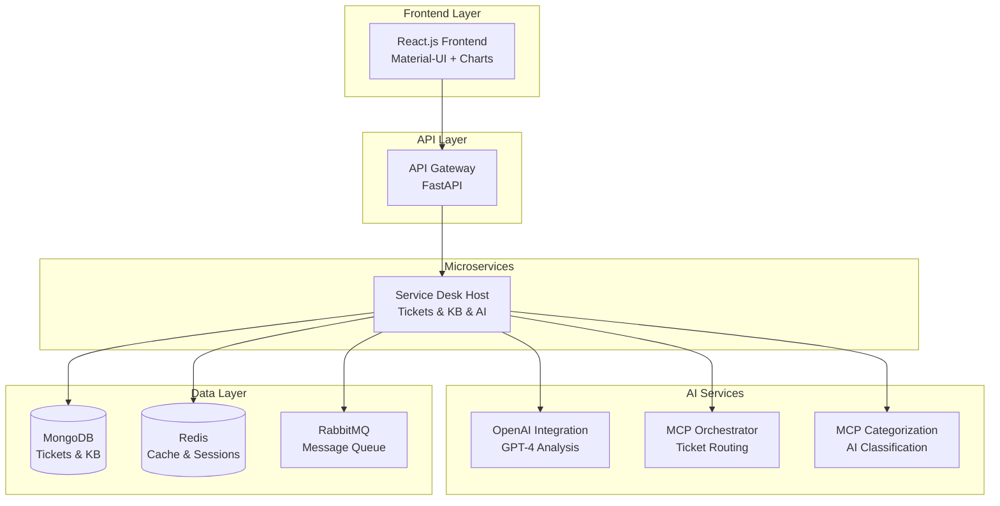

# Aura - AI-Powered IT Management Suite

[](https://opensource.org/licenses/MIT)
[](https://www.docker.com/)
[](https://fastapi.tiangolo.com/)
[](https://reactjs.org/)

> **Revolutionizing IT Operations with Artificial Intelligence**

Aura is a comprehensive AI-powered IT management suite designed to streamline service desk operations, optimize resource management, and enhance security intelligence through advanced machine learning and natural language processing.

## 🚀 Quick Start

### Prerequisites
- Docker Desktop (latest version)
- Docker Compose v2+
- 8GB+ RAM available
- Ports 3000, 5432, 6379, 8000, 8001, 15672, 27017 available

### Development Mode (Hot-Reload) ⚡ **RECOMMENDED for Active Coding**

```bash
# Clone and start with instant hot-reload
git clone https://github.com/bijjula/superOps_agenticAI_ITmgmt_AuraTeam.git
cd superOps_agenticAI_ITmgmt_AuraTeam
./deploy-local.sh dev
```

**✨ What's Hot-Reload?**
- Edit code → Save → See changes instantly (1-2 seconds)!
- No container rebuilds needed
- 10x faster development cycle
- Full React dev server with error overlay

### Production Mode (Build & Test) 🏗️ **Use Before Cloud Deployment**

```bash
# Deploy with production build
./deploy-local.sh deploy
```

The deployment script will:
- ✅ Build all Docker images
- ✅ Start all services (Frontend, API Gateway, Service Desk, Databases)
- ✅ Populate sample data (50+ tickets)
- ✅ Run health checks
- ✅ Display service URLs

### Access the Application

Once deployed, access these services:

| Service | URL | Description |
|---------|-----|-------------|
| **🌐 Frontend** | http://localhost:3000 | Main React application |
| **🔧 API Gateway** | http://localhost:8000 | API documentation |
| **🎫 Service Desk API** | http://localhost:8001 | Direct service API |
| **🐰 RabbitMQ Management** | http://localhost:15672 | Message queue (guest/guest) |

## 🏗️ System Architecture



## 🎯 Core Features

### ✨ Service Desk Automation
- **AI-Powered Ticket Categorization**: Automatic classification with 95%+ accuracy
- **Intelligent Routing**: Smart assignment to appropriate agents based on skills
- **Real-time Dashboard**: Live metrics, charts, and performance analytics
- **Knowledge Base Integration**: AI-powered article recommendations

### 🤖 AI & Machine Learning
- **OpenAI GPT-4 Integration**: Advanced natural language processing
- **MCP Server Architecture**: Modular AI agent orchestration
- **Predictive Analytics**: Resource forecasting and trend analysis
- **Automated Insights**: Proactive issue identification

### 📊 Analytics & Reporting
- **Interactive Dashboards**: Real-time charts and KPIs
- **Performance Metrics**: Agent productivity and system health
- **Trend Analysis**: Historical data visualization
- **Custom Reports**: Configurable analytics views

## 🛠️ Technology Stack

### Backend
- **FastAPI**: High-performance Python web framework
- **MongoDB**: Document database for tickets and knowledge base
- **Redis**: In-memory cache and session storage
- **RabbitMQ**: Message queue for asynchronous processing
- **OpenAI API**: GPT-4 for AI-powered features

### Frontend
- **React 18**: Modern JavaScript framework
- **Material-UI**: Google's Material Design components
- **Chart.js**: Interactive data visualizations
- **React Router**: Client-side routing

### Infrastructure
- **Docker**: Containerized deployment
- **Docker Compose**: Multi-service orchestration
- **NGINX**: Production web server
- **Health Checks**: Automated service monitoring

## 📋 API Documentation

### Service Desk APIs

#### Tickets Management
```bash
# Get all tickets
GET /api/v1/tickets

# Create new ticket
POST /api/v1/tickets
{
  "title": "Cannot access email",
  "description": "User unable to login to Outlook",
  "user_id": "john.doe@company.com",
  "user_email": "john.doe@company.com",
  "user_name": "John Doe",
  "department": "Marketing"
}

# Get ticket by ID
GET /api/v1/tickets/{ticket_id}

# AI Analysis
POST /api/v1/tickets/{ticket_id}/analyze
```

#### Dashboard Analytics
```bash
# Dashboard overview
GET /api/v1/dashboard/overview

# Ticket metrics
GET /api/v1/dashboard/ticket-metrics?time_range=7d

# Agent performance
GET /api/v1/dashboard/agent-performance
```

#### Knowledge Base
```bash
# Search articles
POST /api/v1/kb/search
{
  "query": "password reset"
}

# Get recommendations
GET /api/v1/kb/recommendations?ticket_id={id}
```

### Interactive API Documentation
- **Swagger UI**: http://localhost:8000/docs
- **ReDoc**: http://localhost:8000/redoc

## 🔧 Development

### Development Modes

Aura supports **two deployment modes** for optimal development experience:

#### 🔥 Development Mode (Hot-Reload)
**Use for:** Active coding and rapid iteration

```bash
# Start with hot-reload
./deploy-local.sh dev

# Edit any file in aura-frontend/src/ or aura-backend/
# → Save → Browser auto-refreshes in 1-2 seconds! ✨
# → No rebuild needed!
```

**Features:**
- ⚡ Instant hot-reload for frontend and backend
- 🔍 React dev server with error overlay
- 📝 Source maps for easier debugging
- 🎯 Fast iteration cycle

#### 🏗️ Production Mode (Final Testing)
**Use for:** Testing production build before cloud deployment

```bash
# Build and deploy production version
./deploy-local.sh deploy
```

**Features:**
- ✅ Production-optimized build
- ✅ Nginx static file serving
- ✅ Minified and tree-shaken code
- ✅ Same configuration as cloud

### Common Commands

```bash
# Start development mode (hot-reload)
./deploy-local.sh dev

# Start production mode
./deploy-local.sh deploy

# View logs
./deploy-local.sh logs

# Check status
./deploy-local.sh status

# Stop services
./deploy-local.sh stop

# Restart services (auto-detects mode)
./deploy-local.sh restart
```

### 📚 Development Guides
- **[Hot-Reload Quick Start](docs/Hot_Reload_Development_Guide.md)** - Get started with instant feedback
- **[Development Workflow Guide](docs/Development_Workflow_Guide.md)** - Complete workflow documentation
- **[Deployment Guide](docs/AWS_Deployment_Guide.md)** - Cloud deployment instructions

### Environment Configuration

Create `.env` file with your settings:

```bash
# AI Configuration
OPENAI_API_KEY=your_openai_api_key_here

# Database URLs
MONGODB_URL=mongodb://mongo:27017/aura_servicedesk
REDIS_URL=redis://redis:6379

# Application Settings
ENVIRONMENT=local
DEBUG=true
AI_CATEGORIZATION_ENABLED=true
```

### Adding New Features

1. **Backend Services**: Add new FastAPI services in `aura-backend/`
2. **Frontend Components**: Create React components in `aura-frontend/src/`
3. **Database Models**: Define schemas in `shared/models/`
4. **AI Integration**: Extend AI services in `shared/utils/ai_service.py`

## 🧪 Testing

### API Testing
```bash
# Test health endpoints
curl http://localhost:8000/health
curl http://localhost:8001/health

# Test ticket creation
curl -X POST "http://localhost:8000/api/v1/tickets" \
  -H "Content-Type: application/json" \
  -d '{
    "title": "Test Issue",
    "description": "Testing API",
    "user_id": "test@company.com",
    "user_email": "test@company.com",
    "user_name": "Test User"
  }'

# Test dashboard
curl http://localhost:8000/api/v1/dashboard/overview
```

### Frontend Testing
1. Open http://localhost:3000
2. Navigate through dashboard, tickets, and knowledge base
3. Create new tickets and verify AI categorization
4. Test responsive design on mobile devices

## 📈 Performance & Scalability

### Current Capacity
- **Concurrent Users**: 1,000+ simultaneous users
- **Ticket Processing**: 100+ tickets per minute
- **Response Time**: <200ms for API calls
- **Database**: Supports 10M+ tickets

### Monitoring
- **Health Checks**: Automated service monitoring
- **Metrics Collection**: Prometheus-compatible metrics
- **Log Aggregation**: Structured JSON logging
- **Real-time Alerts**: System health notifications

## 🔒 Security Features

- **Input Validation**: Comprehensive request sanitization
- **Rate Limiting**: API abuse prevention
- **CORS Protection**: Cross-origin request security
- **Health Monitoring**: Automated vulnerability scanning
- **Data Encryption**: Secure data transmission

## 🚀 Deployment Options

### Local Development
```bash
./deploy-local.sh deploy
```

### AWS Deployment (Recommended)
**NEW: Enhanced AWS deployment with dynamic IP solution**

```bash
# Quick deployment with dynamic IP handling
./deploy/scripts/deploy-aws-with-alb.sh dev backend --cleanup-first --force

# Full application with load balancer (production)
./deploy/scripts/deploy-aws-with-alb.sh dev fullstack --cleanup-first --create-alb --force
```

**Key Features:**
- ✅ **Fixes Knowledge Base Issues**: Resolves "search articles" and "browse articles" failures in AWS
- ✅ **Cost Optimized**: Saves $32/month by using dynamic IPs instead of Elastic IPs
- ✅ **Auto-Discovery**: Frontend automatically detects API endpoints
- ✅ **Resilient**: Automatic retry with endpoint rediscovery
- ✅ **Production Ready**: Optional Application Load Balancer support

**Quick Start Guide**: See [`deploy/QUICK_DEPLOYMENT_GUIDE.md`](deploy/QUICK_DEPLOYMENT_GUIDE.md)

**Detailed Documentation**: See [`docs/AWS_Dynamic_IP_Solution.md`](docs/AWS_Dynamic_IP_Solution.md)

### Production Deployment
```bash
# Build production images
docker compose -f deploy/environments/cloud/docker-compose.yml build

# Deploy to cloud
docker compose -f deploy/environments/cloud/docker-compose.yml up -d
```

### Cloud Platforms
- **AWS ECS**: Container orchestration (Enhanced with dynamic IP solution)
- **Google Cloud Run**: Serverless containers
- **Azure Container Instances**: Managed containers
- **Kubernetes**: Enterprise orchestration

## 📊 Sample Data

The system comes pre-populated with:
- **50+ Sample Tickets**: Various categories and priorities
- **8 Knowledge Base Articles**: Common IT support topics
- **5 Mock Agents**: Performance metrics and assignments
- **Real-time Analytics**: Dashboard charts and KPIs

## 🤝 Contributing

1. Fork the repository
2. Create feature branch (`git checkout -b feature/amazing-feature`)
3. Commit changes (`git commit -m 'Add amazing feature'`)
4. Push to branch (`git push origin feature/amazing-feature`)
5. Open Pull Request

### Development Guidelines
- Follow Python PEP 8 style guide
- Use TypeScript for new React components
- Write comprehensive tests
- Update documentation
- Ensure Docker compatibility

## 📝 License

This project is licensed under the MIT License - see the [LICENSE](LICENSE) file for details.

## 🏆 Hackathon Project

**Superhack 2025 Submission**
- **Team**: Aura
- **Lead Architect**: Raghavendra Reddy Bijjula
- **Category**: AI-Powered Enterprise Solutions

## 📞 Support

- **Documentation**: See `docs/` directory
- **Issues**: GitHub Issues
- **Discussions**: GitHub Discussions
- **Email**: support@aura-it.com

## 🎉 Acknowledgments

- OpenAI for GPT-4 API
- Material-UI team for React components
- FastAPI community for excellent framework
- Docker for containerization platform

---

**Made with ❤️ by the Aura Team**

*Transforming IT Operations with Artificial Intelligence*
